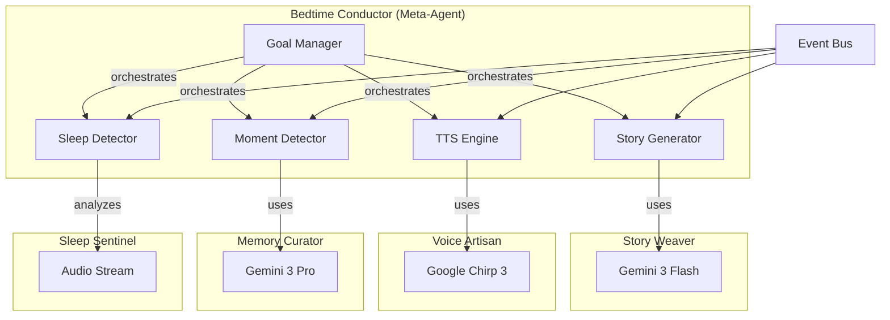
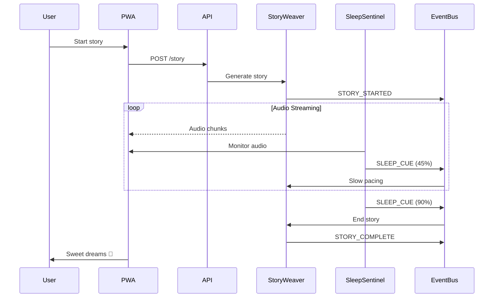
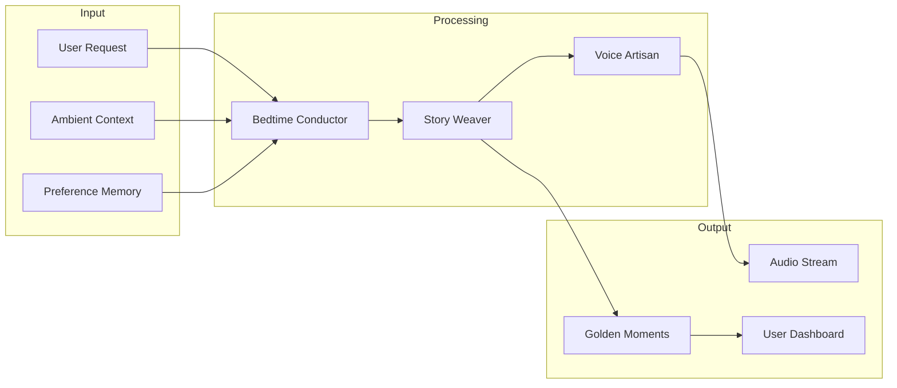
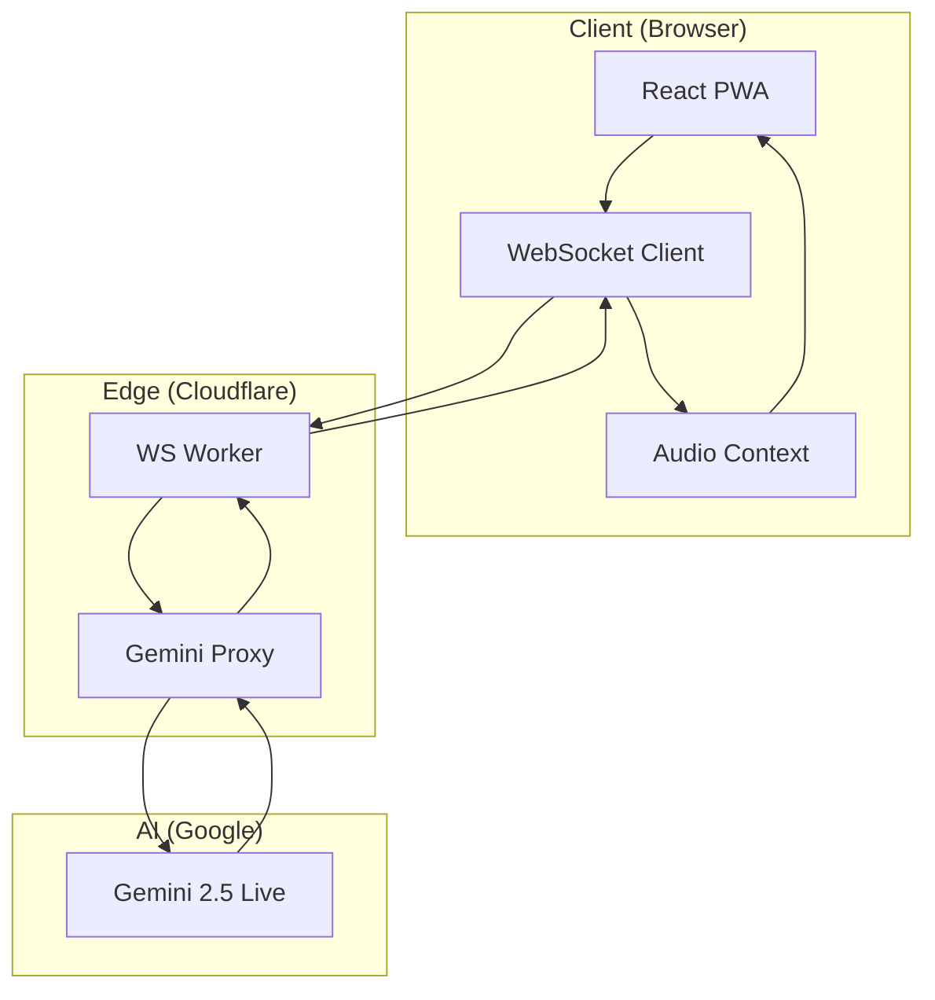
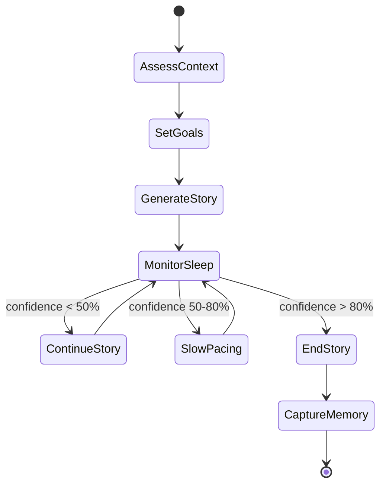

# 22. Agentic Diagrams

## Agent Architecture

```mermaid
graph TB
    subgraph "Bedtime Conductor (Meta-Agent)"
        BC[Goal Manager]
        BC --> |orchestrates| SW
        BC --> |orchestrates| VA
        BC --> |orchestrates| MC
        BC --> |orchestrates| SS
    end
    
    subgraph "Story Weaver"
        SW[Story Generator]
        SW --> |uses| Gemini[Gemini 3 Flash]
    end
    
    subgraph "Voice Artisan"
        VA[TTS Engine]
        VA --> |uses| Chirp[Google Chirp 3]
    end
    
    subgraph "Memory Curator"
        MC[Moment Detector]
        MC --> |uses| Pro[Gemini 3 Pro]
    end
    
    subgraph "Sleep Sentinel"
        SS[Sleep Detector]
        SS --> |analyzes| Audio[Audio Stream]
    end
    
    EventBus[Event Bus] --> SW
    EventBus --> VA
    EventBus --> MC
    EventBus --> SS
```

---

## Event Flow

```mermaid
sequenceDiagram
    participant User
    participant PWA
    participant API
    participant StoryWeaver
    participant SleepSentinel
    participant EventBus
    
    User->>PWA: Start story
    PWA->>API: POST /story
    API->>StoryWeaver: Generate story
    StoryWeaver->>EventBus: STORY_STARTED
    
    loop Audio Streaming
        StoryWeaver-->>PWA: Audio chunks
        SleepSentinel->>PWA: Monitor audio
        SleepSentinel->>EventBus: SLEEP_CUE (45%)
        EventBus->>StoryWeaver: Slow pacing
    end
    
    SleepSentinel->>EventBus: SLEEP_CUE (90%)
    EventBus->>StoryWeaver: End story
    StoryWeaver->>EventBus: STORY_COMPLETE
    PWA->>User: Sweet dreams 🌙
```

---

## Data Flow

```mermaid
graph LR
    subgraph "Input"
        UR[User Request]
        AC[Ambient Context]
        PM[Preference Memory]
    end
    
    subgraph "Processing"
        BC[Bedtime Conductor]
        SW[Story Weaver]
        VA[Voice Artisan]
    end
    
    subgraph "Output"
        AS[Audio Stream]
        GM[Golden Moments]
        UD[User Dashboard]
    end
    
    UR --> BC
    AC --> BC
    PM --> BC
    BC --> SW
    SW --> VA
    VA --> AS
    SW --> GM
    GM --> UD
```

---

## Live Session Architecture

```mermaid
graph TB
    subgraph "Client (Browser)"
        PWA[React PWA]
        WS[WebSocket Client]
        Audio[Audio Context]
    end
    
    subgraph "Edge (Cloudflare)"
        Worker[WS Worker]
        Proxy[Gemini Proxy]
    end
    
    subgraph "AI (Google)"
        Live[Gemini 2.5 Live]
    end
    
    PWA --> WS
    WS --> Worker
    Worker --> Proxy
    Proxy --> Live
    Live --> Proxy
    Proxy --> Worker
    Worker --> WS
    WS --> Audio
    Audio --> PWA
```

---

## Goal Resolution

```mermaid
stateDiagram-v2
    [*] --> AssessContext
    AssessContext --> SetGoals
    SetGoals --> GenerateStory
    
    GenerateStory --> MonitorSleep
    MonitorSleep --> ContinueStory: confidence < 50%
    MonitorSleep --> SlowPacing: confidence 50-80%
    MonitorSleep --> EndStory: confidence > 80%
    
    ContinueStory --> MonitorSleep
    SlowPacing --> MonitorSleep
    EndStory --> CaptureMemory
    CaptureMemory --> [*]
```
