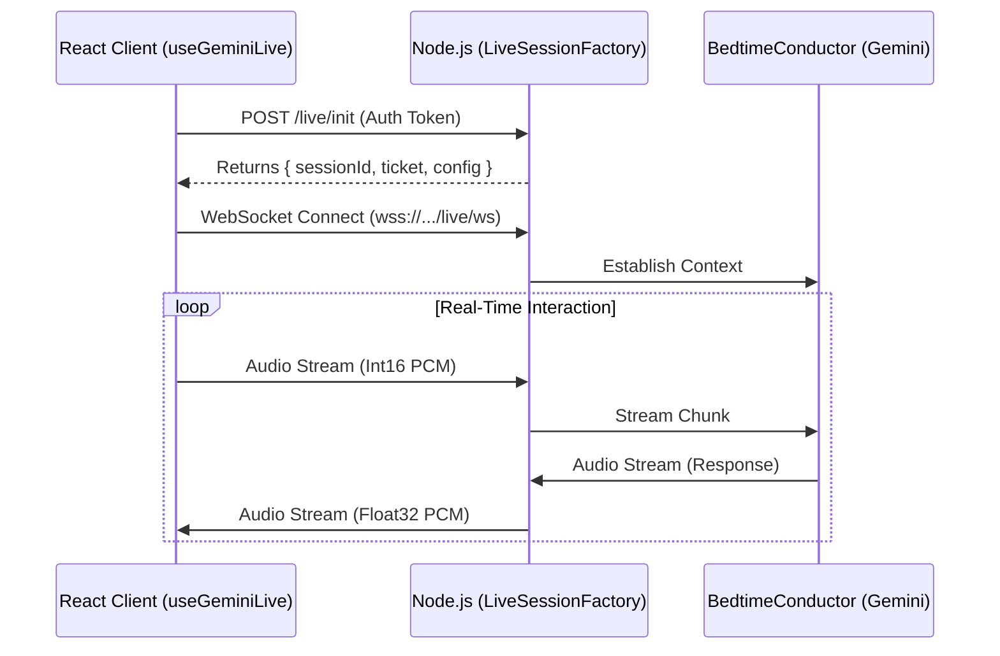

# Voice Cloning & Live Mode Architecture

## 1. Overview
This document outlines the user flow and technical architecture for the **Voice Cloning** and **Live Mode** features in DreamWeaver. These features enable users to clone their own voice for story narration and interact with the Bedtime Conductor in real-time.

## 2. User Flow

### 2.1. Voice Cloning (Real App)
1.  **Navigation**: User logs in and navigates to `Settings` -> `Voice`.
2.  **Recording**: User clicks "Record Voice Sample".
3.  **Capture**: User reads a short prompt. The browser captures audio via `MediaRecorder` API.
4.  **Upload**: User reviews and uploads the recording.
5.  **Processing**: The system processes the audio and creates a `VoiceProfile`.
6.  **Usage**: When generating a new story, the user selects "My Cloned Voice" as the narrator.

### 2.2. Live Mode (Real App)
1.  **Initiation**: User navigates to the "Live" tab.
2.  **Connection**: User clicks "Start Live Session". A WebSocket connection is established.
3.  **Interaction**: User speaks to the Conductor.
4.  **Response**: The Conductor responds with low-latency audio using the user's child's context.

---

## 3. Technical Architecture

### 3.1. Voice Cloning Logic
The voice cloning pipeline integrates frontend recording with backend storage and 3rd-party TTS services.

```mermaid
sequenceDiagram
    participant User
    participant VoiceSettingsPage
    participant API as /voice/upload
    participant UseCase as UploadVoiceUseCase
    participant Storage as Supabase Storage
    participant DB as Supabase DB
    participant TTS as CompositeTTSAdapter
    participant HF as HuggingFace/XTTS

    Note over User, VoiceSettingsPage: Recording Phase
    User->>VoiceSettingsPage: Record audio sample
    VoiceSettingsPage->>API: POST /voice/upload (audio blob)
    API->>UseCase: execute(userId, audioData)
    UseCase->>Storage: Upload audio file
    Storage-->>UseCase: Returns Public URL
    UseCase->>DB: Save VoiceProfile { voiceModelId: URL, status: 'ready' }
    UseCase-->>API: Return Profile
    API-->>VoiceSettingsPage: Success

    Note over User, TTS: Usage Phase
    User->>StoryRequestPage: Generate Story (select cloned voice)
    StoryRequestPage->>GenerateStoryUseCase: execute(..., voiceProfileId)
    GenerateStoryUseCase->>DB: findById(voiceProfileId)
    DB-->>GenerateStoryUseCase: VoiceProfile
    GenerateStoryUseCase->>TTS: synthesize(text, voiceProfile)
    
    rect rgb(20, 20, 30)
        Note right of TTS: Adaptation Layer
        TTS->>TTS: Check if voiceModelId starts with "http"
        TTS->>HF: If http (Clone), call HuggingFace XTTS
        HF-->>TTS: Return generated audio
    end
    
    TTS-->>GenerateStoryUseCase: audioUrl
```

### 3.2. Live Mode Architecture
Live mode uses a WebSocket relay to connect the client to the AI agent with minimal latency.

## 4. Key Components

### 4.1. `VoiceProfile` Entity
-   **Structure**: Contains `userId`, `sampleUrl`, `voiceModelId` (which acts as the reference for TTS), and `status`.
-   **Security**: Only the owner can access or use their voice profile.

### 4.2. `CompositeTTSAdapter`
-   **Routing**: Intelligently routes requests based on the voice ID format.
    -   Standard IDs (e.g., `en-US-Journey-F`) -> Google TTS.
    -   URL-based IDs (e.g., `https://...`) -> HuggingFace XTTS (Cloning).

### 4.3. `SafetyGuardian`
-   **Integration**: All content generated, including that narrated by cloned voices, passes through the `SafetyGuardian` to ensure COPPA compliance and appropriate content.
